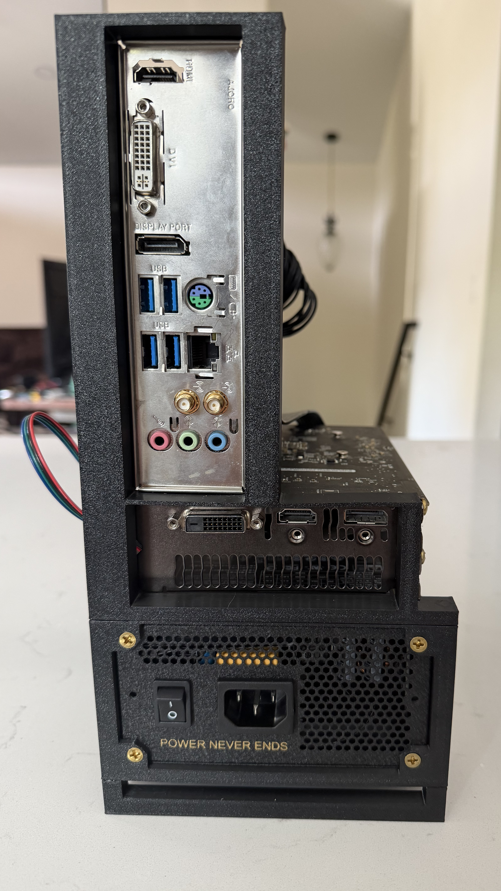
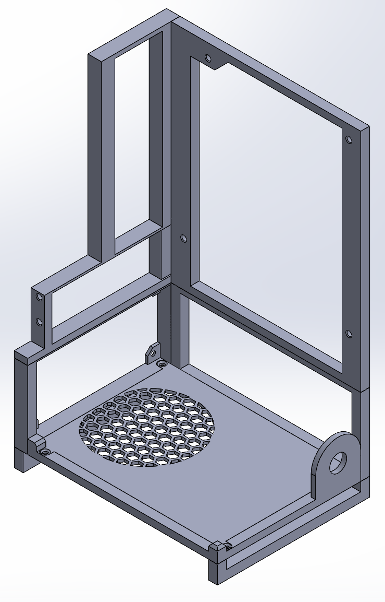

# 3D Printed Mini-ITX PC Case (SFX PSU)

## Introduction

A custom, 3D printed open-frame PC case built to house a Mini-ITX motherboard and an SFX power supply.

### Design Features

- Supports Mini-ITX motherboards and SFX power supplies
- 142 × 191 mm (5.6 × 7.5 in) footprint
- 8.25 L volume
- Rear PSU intake vent
- Raised bottom with GPU intake
- Prints without supports
- Designed for PETG

### Compatibility

| Component | Limit |
| --- | --- |
| Motherboard | Mini-ITX |
| Power supply | SFX |
| GPU | Any (open frame) |
| Printer bed | 250 × 210 × 220 mm or larger (designed on a Prusa MK4S) |

## Repository Contents

| Folder / File | Contents |
| --- | --- |
| `cad/solidworks/` | Native SolidWorks parts and assembly (SolidWorks 2025) |
| `cad/step/` | STEP (AP214) exports for any CAD program |
| `stl/` | Print-ready STL files |
| `docs/` | Reference drawings, photos, and renders |
| [`BOM.csv`](BOM.csv) | Bill of materials: printed parts, filament (~312 g PETG), and hardware |

## Design Considerations

The `docs/` folder includes the reference drawings used for the CAD dimensions. I've found them accurate for this project. If you modify the design, check your changes against these drawings so your components still fit.

### GPU Airflow

The case is designed with GPU airflow in mind: the bottom is raised and has an intake for the GPU.

### Printing and Assembly

The case was designed in SolidWorks to print on a Prusa MK4S (250 × 210 × 220 mm bed) without supports, which saves filament and print time.

The frame is held together with 3D printed pins. Printer tolerances vary, so print a pin first, test the fit, and adjust if needed.

**Tools needed:** soldering iron (for the heat-set inserts) and a Phillips screwdriver.

### Material

PC components generate heat, so PETG is recommended. It handles heat better than PLA, which can soften near warm components. If you use other materials, print and build at your own risk.

## License

The design files in this repository are licensed under [CC BY-NC 4.0](https://creativecommons.org/licenses/by-nc/4.0/). You're welcome to remix, modify, and build on this design for personal projects. Please credit "Jack Saussy" and link back to this repository. Commercial use, including selling files or printed copies, is not permitted.